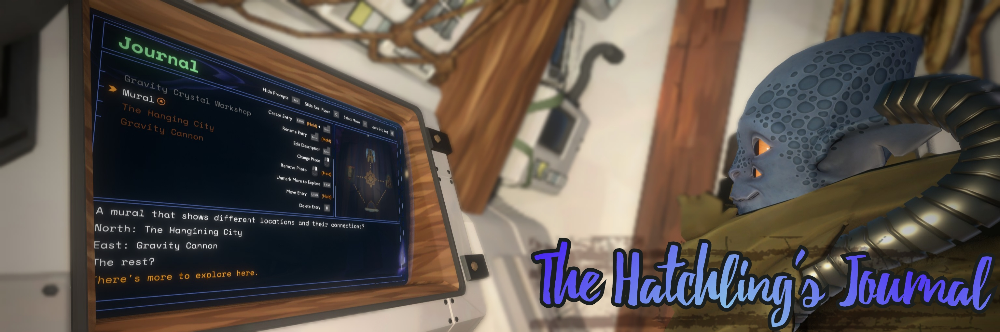

# The Hatchling's Journal by Damián Garro

This is **your** journal. A [Custom Ship Log Mode](https://outerwildsmods.com/mods/customshiplogmodes/) added to your computer that lets you create and view your own Ship Log entries. 

Entries are displayed in a list that looks like the one from the vanilla Map Mode. You can write any name and description (the text that appears in the field below the list) and edit them anytime (or even delete or reorder them).

Maybe you want to complement the vanilla Ship Log with your own notes (without using an external tool), or you want a more challenging experience by ignoring the game Ship Log altogether and rely completely on the things you write. Have you already won the game? You could use this tool to play the DLC if you haven't already, or even with some of the [story mods](https://outerwildsmods.com/mods/?tag=story). However, this can be used for anything else you have in mind, here there are some ideas, but the possibilities are endless:
- Replay the game with a more role-play experience by writing the Hatchling's journey from their perspective
- Write down your school notes so you can study for that exam without leaving your spaceship
- Use this as your grocery list

This mod unleashes the full power of [Épicas Album](https://outerwildsmods.com/mods/picasalbum/). Any snapshot you have taken and uploaded to that album (or just memes you moved to the folder) can be used as the photo of your Journal's entries.

Entries without photos are displayed with orange names. That is like in the base game, where these entries represent "rumors" that weren't explored yet, but you don't necessarily have to adhere to these semantics for your notes.

You can also add the "More to Explore" icon to the entries, that also includes the *"There's more to explore here."* orange item to the description, but you may also this to just mark some entries that you consider that needs some particular attention.

Input fields (for the entry name and description) require the usage of the keyboard, if you're a gamepad user you should put it down when you want to create entries or edit some of the texts. These fields also allow some usual commands like copy and paste, moving the caret or selecting text.

## The savefile

The changes made to your Journal are saved when you exit the mode (changing to another Ship Log Mode or exiting the computer). This is saved to disk in the "saves" folder inside of the mod folder. Each Outer Wilds profile has its own separate Journal. There's a file "(profile name).json" (**JSON** file) for each of them. If you consider your journal valuable, please backup this as you should do with any file you don't want to lose (this also applies to the images from Épicas Album that you could use in your Journal, backup them too).

Also, remember that uninstalling the mod (not disabling it) completely deletes the mod folder including all the saves!

You may also see that there are some "(profile name).json.old" (**OLD** file) files in the "saves" folder. This is a backup the mod automatically does; sometimes when the Journal is saved, a copy of the previous file is made (adding the ".old" extension) before overwriting the savefile with the new changes. This happens on the first save made in each loop. The file is there just in case you messed up and you want to restore a previous version of your Journal (simply delete the main JSON file and remove the ".old" extension from the OLD file in that case).

Please avoid manually editing the savefile unless you really know what you are reading. If the game is unable to read your savefile (maybe because you broke something by editing it, or maybe because some unknown bug), the Journal would start empty again. But don't worry, if that happens, a ".corrupted" extension is added to the savefile to prevent it from being overwritten by the new fresh Journal. That means that you would find a file named "(profile name).json.corrupted" (**CORRUPTED** file). You could try to edit the contents of this file to fix any mistake you previously made (and remove the ".corrupted" extension) or ask for help by [opening an issue](https://github.com/dgarroDC/Journal/issues) or going to the [Outer Wilds Modding discord server](https://discord.gg/CRfxGWJG24). Restoring the OLD file might also be an option.